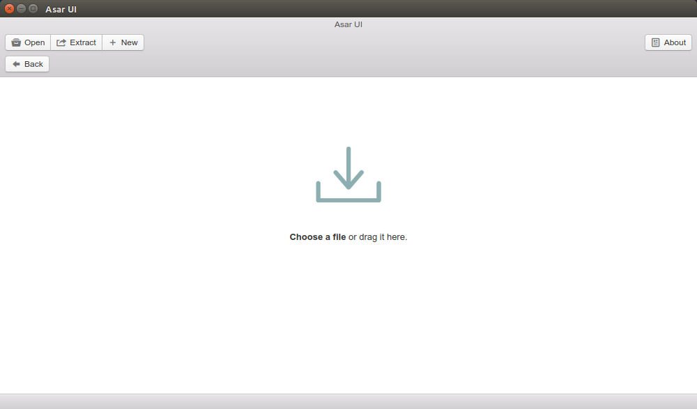
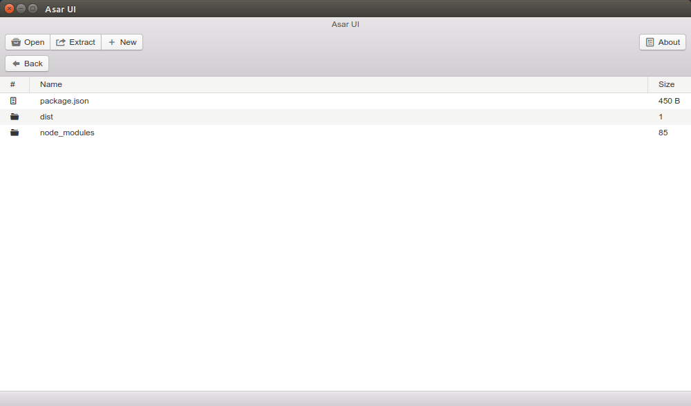

# Asar UI


> UI for Asar, Extract All or drag extract file/directory


## Screenshot




## Next Version
* Create Asar Pack
* Breadcrumb
* Extract Open File
* Extracted Open File watch changes and merge

#### Build Setup

``` bash
# install dependencies
npm install

# serve with hot reload at localhost:9080
npm run dev

# build electron application for production
npm run build


```

---

This project was generated with [electron-vue](https://github.com/SimulatedGREG/electron-vue)@[88c386d](https://github.com/SimulatedGREG/electron-vue/tree/88c386d59c5f0b17046afc6adc7fa1170e85c6b8) using [vue-cli](https://github.com/vuejs/vue-cli). Documentation about the original structure can be found [here](https://simulatedgreg.gitbooks.io/electron-vue/content/index.html).
